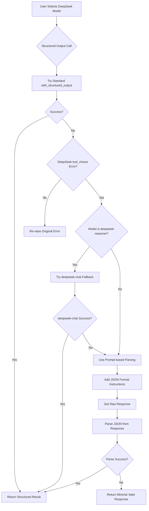

# DeepSeek Structured Output Solution

## Overview

This document describes the sophisticated solution implemented to handle DeepSeek models' compatibility issues with LangChain's structured output functionality.

## Problem Statement

DeepSeek's reasoning model (`deepseek-reasoner`) doesn't support the `tool_choice` parameter used by LangChain's `with_structured_output()` method. However, their chat model (`deepseek-chat`) does support this parameter. This creates a compatibility issue where users selecting `deepseek-reasoner` would encounter errors when the application tries to generate structured JSON responses.

## Solution Architecture

The solution implements a multi-tiered fallback strategy that intelligently handles DeepSeek models:

### 1. Detection and Fallback Logic

The enhanced `get_structured_output()` function in `src/open_deep_research/graph.py` implements the following logic:

```python
async def get_structured_output(model, schema_class, messages, model_name=None, provider=None, model_kwargs=None):
    """Get structured output from a model with intelligent fallback for DeepSeek models."""
```

### 2. Fallback Strategies

#### Strategy 1: Model Substitution
- When `deepseek-reasoner` is detected and fails with a `tool_choice` error
- Automatically switches to `deepseek-chat` for structured output calls
- Preserves the user's original model choice for regular text generation

#### Strategy 2: Prompt-Based Parsing
- If model substitution fails or is not applicable
- Uses `PydanticOutputParser` to generate JSON format instructions
- Appends instructions to the prompt asking for JSON output
- Parses the response to extract and validate JSON

#### Strategy 3: Minimal Valid Response
- As a last resort, returns a minimal valid response matching the schema
- Ensures the application continues functioning even in edge cases

### 3. Implementation Details

#### Enhanced Files

1. **src/open_deep_research/graph.py**
   - Added sophisticated `get_structured_output()` function
   - Added `create_deepseek_compatible_model()` helper
   - Updated all structured output calls to pass model information

2. **src/open_deep_research/utils.py**
   - Enhanced `summarize_webpage()` function with DeepSeek compatibility
   - Added fallback logic for structured output failures

#### Flow Diagram



## Benefits

1. **User Experience**: Users can select any DeepSeek model without worrying about compatibility
2. **Transparency**: The system handles issues gracefully without removing model options
3. **Flexibility**: Multiple fallback strategies ensure robust operation
4. **Maintainability**: Centralized handling makes future updates easier

## Testing

A test script (`test_deepseek_structured_output.py`) is provided to verify the implementation:

```bash
python test_deepseek_structured_output.py
```

The test covers:
- DeepSeek reasoner with fallback behavior
- DeepSeek chat with normal operation
- Non-DeepSeek models to ensure no regression

## Usage

No changes are required from the user's perspective. Simply:

1. Select any DeepSeek model in the Streamlit UI
2. The application automatically handles compatibility
3. Structured outputs work seamlessly across all models

## Technical Notes

- The solution preserves the original model for non-structured output operations
- Fallback mechanisms are only triggered for structured output calls
- Error messages are logged for debugging while maintaining smooth operation
- The implementation is extensible for future model compatibility issues

## Future Enhancements

1. Cache deepseek-chat instances for performance
2. Add telemetry to track fallback usage
3. Implement model-specific optimizations
4. Consider implementing a model capability registry 